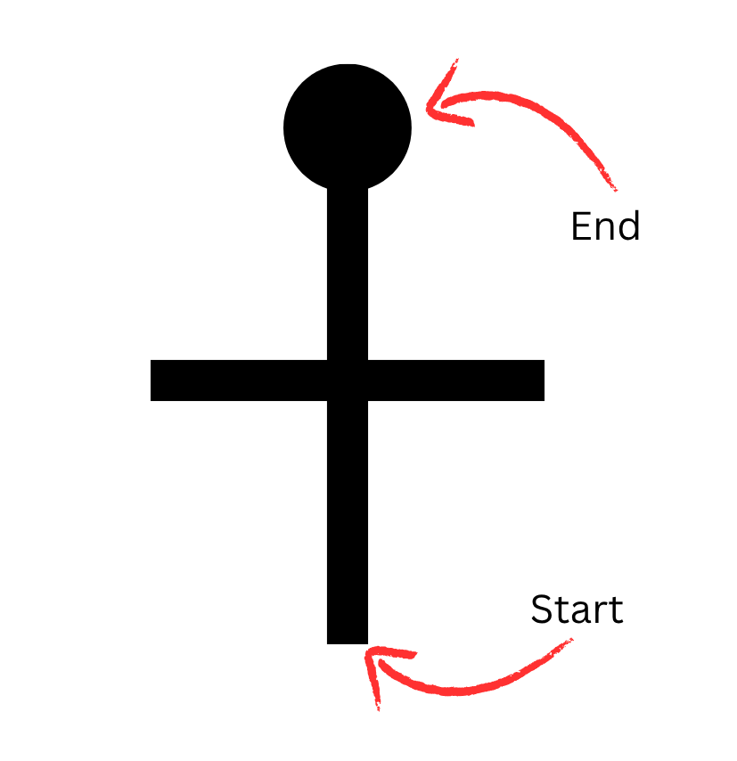
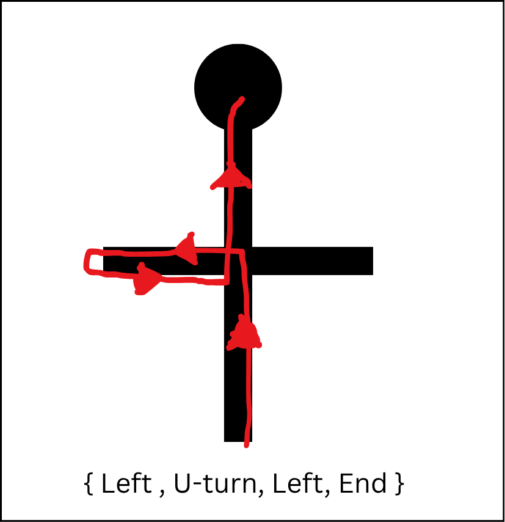
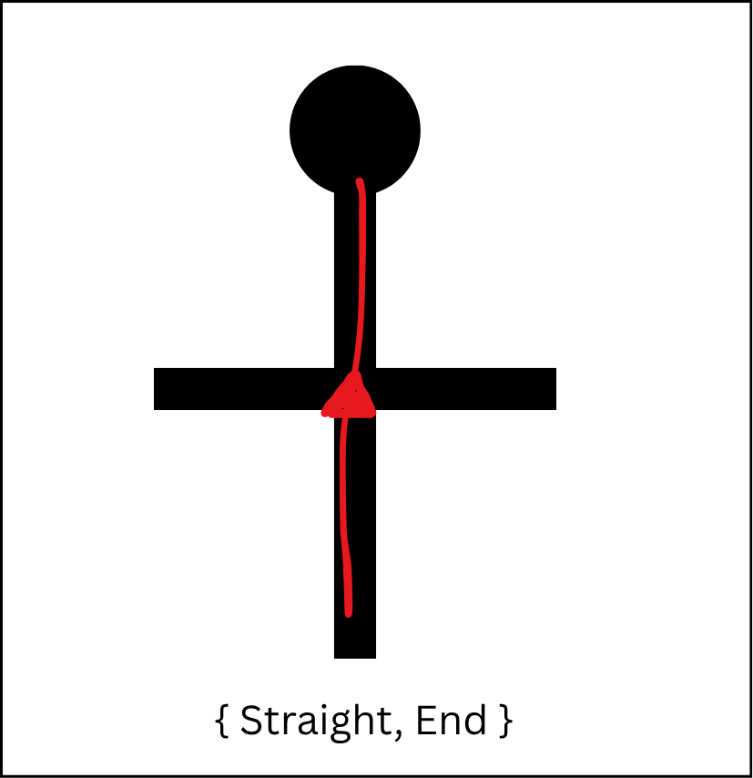
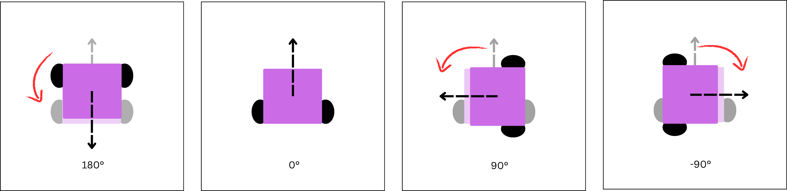

# no-brain-linemaze-solver
Simple line maze solver, intended to show how beginners can solve line mazes without loops. 


<figure>
  
  <figcaption><i>A simple example of a line maze</i></figcaption>
</figure>

## Building
It's simple just build it with g++ using your terminal
```
g++ shortest_path.cpp -o shortest_path.o
```
## Running
```
./shortest_path.o
```

## How it works
This algorithm relies on the recognition of turn sequences that can be simplified. 

### Assumptions
- The robot traverses the line maze using either a left-hand or right-hand rule
- There are no loops in the maze
- Only turns taken at an intersection can be simplified

### Maze representation
For this demo, we assume that the maze is percieved using the actions that a line-tracing robot makes when traversing it. 

Actions taken when first traversing the line maze is assumed to be stored in a `vector<char>` where each turn/action performed at an intersection is represented as a `char`. See below:

| Letter | Action |
| ---- | ---- | 
| `L` | Left turn|
| `R` | Right turn|
| `U` | U-turn|
| `S` | Head Straight |
| `E` | Maze end encountered (stopped) | 


An example of a initial traversal of a maze:
```
L ,U ,L ,E
```
<figure>
  
  <figcaption><i>The long path using left-hand rule</i></figcaption>
</figure>

### Patterns recognized 
After a first traversal is made, the algorithm can now be used to naively simplify the route based on a few known patterns.
| Pattern | Simplified result | Description |
| -------- | --------- | -------- |
| `L U L` | `S` | U-turn after a left |
| `R U R` | `S` | U-turn after a right |
| `S U L` | `R` | U-turn after going straight (while using Left-hand rule) |
| `S U R` | `L` | U-turn after going straight (while using Right-hand rule) |

If we apply this to a maze from the previous example
```
L ,U ,L  ,E
```

will be simplified to

```
S , E
```
<figure>
  
  <figcaption><i>Shortest path after patterns are replaced</i></figcaption>
</figure>

### How are patterns recognized?
To recognize patterns we simply tracked the resulting "turn angle" or the sum of degrees turned. Assuming the robot's "heading" or angle is initially `0 degrees`. We the increment or decrement based on the table below

| Turn | Angle |
| ---- | ---- |
| L | 90 |
| R | -90 |
| U | 180 |
| S | 0 |

<figure>
  
  <figcaption><i>how we assign values to the robot's heading</i></figcaption>
</figure>

From here we can add conditionals to match the angle of the pattern. For example `L U L` will result to and angle of `360 degrees`